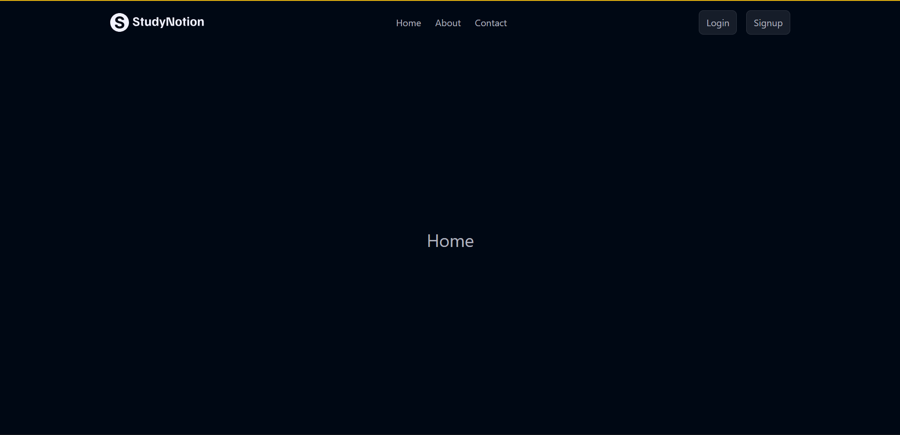
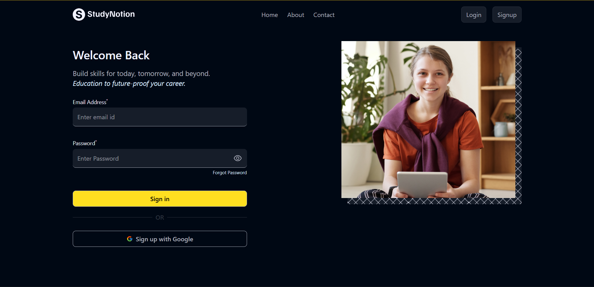
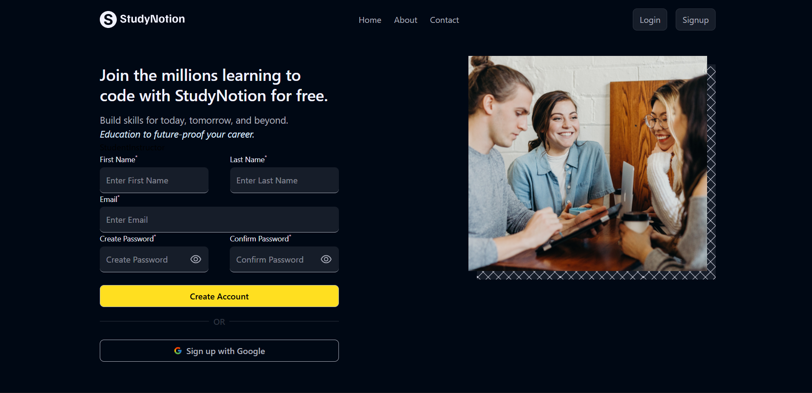
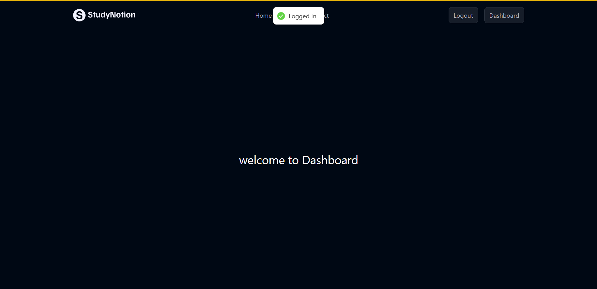

# StudyNotion

A React + Vite education landing page and authentication flow prototype.

## What is complete

- React app scaffolded with Vite and React Router DOM
- Routes for `Home`, `Login`, `Signup`, `Dashboard`, and a `NotFound` page
- Login and signup templates using shared `Template` component
- Login form with email/password inputs, toggleable password visibility, toast notification, and client-side navigation to the dashboard
- Signup form with first name, last name, email, password, confirm password, matching validation, toast notifications, and dashboard redirect
- Navbar with conditional links for login/signup, dashboard access, and logout
- Asset usage for images and icons via `react-icons`
- Tailwind CSS support installed and configured via `@tailwindcss/vite`
- ESLint setup for linting the React codebase

## Screenshots

<!-- Add your screenshots to a `screenshots` folder in the root directory and update the paths below -->

### Home Page


### Login Page


### Signup Page


### Dashboard


## Current project status

### Completed

- Basic navigation and routing
- Auth form UI and local state management
- Toast notifications via `react-hot-toast`
- Password show/hide functionality
- Signup password confirmation validation
- Conditional navbar rendering based on `isLoggedIn` state

### Work in progress / next steps

- Add Home page content and layout
- Build actual Dashboard content and protected routes
- Implement real authentication/backend integration
- Add About/Contact page content and links
- Add stronger form validation and error handling
- Clean up styling and responsive design

## Getting started

Install dependencies:

```bash
npm install
```

Run the app:

```bash
npm run dev
```

Build for production:

```bash
npm run build
```

Run ESLint:

```bash
npm run lint
```
